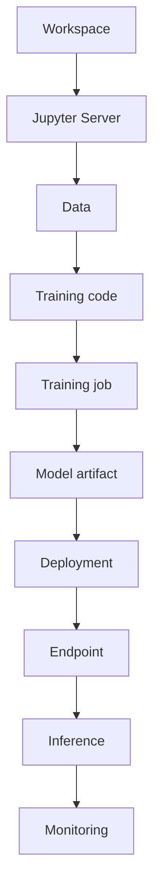

# Product Decisions

**Last updated:** October 2026

This document records product decisions, assumptions, and constraints made while developing the fictional NeuroStack product model.

NeuroStack is a portfolio project. Some product details are intentionally simplified or defined specifically to support the documentation exercise.

When a detail is not defined here or in the product documentation, it should not be treated as established product behavior.

---

## Product Scope

NeuroStack is a cloud platform for developing, training, deploying, and monitoring machine learning models.

The platform provides:

- managed Jupyter environments;
- CPU and GPU compute resources;
- object storage for datasets and model artifacts;
- training jobs;
- model artifacts and model management;
- API endpoints for model deployment;
- inference;
- monitoring;
- REST API and CLI access.

NeuroStack is documented as a cloud product rather than as a generic collection of ML tools.

---

## Documentation Model

The documentation follows a Docs-as-Code approach.

The documentation set is organized around:

- Overview
- Getting Started
- Concepts
- Tutorials
- How-to Guides
- Reference
- Troubleshooting
- FAQ
- Best Practices
- Release Notes
- Glossary

The documentation distinguishes between:

- **Concepts** — explain what a platform resource or concept is;
- **Tutorials** — guide users through a complete scenario;
- **How-to Guides** — explain how to complete a specific task;
- **Reference** — provide precise technical information;
- **Troubleshooting** — help users diagnose and resolve problems.

The Getting Started path follows a complete user journey from billing setup to the first model inference.

---

## Billing

A billing account must be created before users can use paid platform resources.

A billing account must have:

- a payment method;
- an active billing status.

---

### Payment Methods

NeuroStack supports:

- Card
- Invoice
- Internal billing code

An internal billing code is a corporate payment identifier provided by NeuroStack or an account manager. It is not a promotional code.

Invoices are intended for organizations. The organization pays the invoice by bank transfer.

---

### Billing Statuses

A billing account can have the following statuses:

- **Inactive** — the billing account exists but is not active for platform use;
- **Active** — the account can be used to create workspaces and paid resources;
- **Suspended** — the account has outstanding billing issues and is restricted.

An unpaid invoice can result in account suspension.

A suspended account has a seven-day grace period for already-running resources. During suspension, users cannot create new paid resources. After the grace period, running resources are stopped.

After the outstanding debt is paid, the billing account returns to Active.

---

## Workspaces

A workspace is an isolated environment for an ML project.

A workspace combines:

- compute resources;
- object storage;
- user permissions;
- billing;
- project settings.

A workspace can be created through:

- Web Console;
- CLI;
- REST API.

Billing must be active before a workspace can be created.

---

### Workspace Names

A workspace name is a technical resource identifier.

Workspace names may contain:

- Latin letters;
- numbers;
- hyphens.

Spaces, Cyrillic characters, and special characters are not supported.

The restriction exists because the workspace name is used as a technical identifier in APIs, CLI commands, URLs, and internal resource names.

---

### Regions

A workspace is created in a specified region.

Example region identifiers include:

- ru-central1
- eu-central1

The region API parameter is a string. The backend validates whether the requested region is supported.

This allows NeuroStack to add new regions without changing the API format or requiring clients to update a hardcoded list.

Region selection affects resource location, latency, availability, and potentially cost.

---

### Workspace Limits

Workspace and Jupyter Server limits depend on the billing plan.

| Plan | Workspaces | Jupyter Servers per workspace |
|------|------------|-------------------------------|
| Free | 1 | 1 |
| Standard | 5 | 3 |
| Pro | 20 | 10 |
| Enterprise | Custom | Custom |

Other resource quotas may also depend on the plan. Exact quotas are documented separately when defined.

---

### Workspace Roles

NeuroStack uses role-based access control.

**Owner**

Has full workspace access, including:

- billing management;
- user management;
- resource management.

**Admin**

Can manage:

- workspace resources;
- users;
- project settings.

An Admin cannot transfer workspace ownership.

**Editor**

Can work with project resources but cannot manage users or billing.

**Viewer**

Has read-only access to the workspace.

The permission model follows the principle of least privilege: users should only have access to actions required for their role.

---

### Workspace Errors

The following workspace-related errors are defined:

- `BILLING_NOT_LINKED`
- `INSUFFICIENT_PERMISSIONS`
- `INTERNAL_ERROR`
- `WORKSPACE_LIMIT_EXCEEDED`

`BILLING_NOT_LINKED` means that the required billing account is not connected or active.

`INSUFFICIENT_PERMISSIONS` means that the current user does not have permission to perform the requested action.

`INTERNAL_ERROR` indicates an unexpected internal system failure rather than invalid user input.

`WORKSPACE_LIMIT_EXCEEDED` indicates that the workspace quota for the current plan has been reached.

---

## Jupyter Server

A Jupyter Server provides a managed development environment inside a workspace.

Users can select a compute configuration when starting a Jupyter Server.

Currently defined example configurations include:

| Configuration | CPU | RAM | GPU |
|---------------|-----|-----|-----|
| cpu-small | 2 vCPU | 8 GB | None |
| cpu-medium | 4 vCPU | 16 GB | None |
| gpu-small | 4 vCPU | 16 GB | 1 GPU |
| gpu-t4 | 8 vCPU | 32 GB | 1 × T4 |

CPU configurations are suitable for ordinary development and smaller workloads. GPU configurations are intended for workloads that benefit from GPU acceleration, such as deep learning.

Exact pricing and the complete list of supported configurations are not currently defined.

NeuroStack officially supports Python in Jupyter environments. Exact supported Python versions are not currently fixed.

---

## ML Workflow

The primary ML workflow documented by the project is:

Each stage has a corresponding concept or workflow in the documentation.

---

## Training Jobs

A training job is a background process that trains a machine learning model.

Training uses data and training code to produce a trained model.

NeuroStack handles the compute environment required to run the training job so users do not need to manage the underlying infrastructure directly.

Detailed training configuration, scheduling, and API schemas are not yet defined.

---

## Artifacts and Models

A model artifact is a stored snapshot of a trained model that can be registered and used for deployment.

The documentation distinguishes between:

- **artifact** — a stored output produced by a workflow;
- **model** — a trained ML model represented by a registered model artifact and used for deployment or inference.

The exact artifact registry API and metadata schema are not yet defined.

---

## Deployment and Endpoints

Deployment makes a trained model available for inference.

A deployed model is exposed through an API endpoint.

NeuroStack endpoints support auto-scaling.

The exact auto-scaling configuration, scaling metrics, limits, and policies are not yet defined.

---

## Inference

Inference is a request sent to a deployed model endpoint to obtain a prediction or model response.

The exact request and response schemas are not yet defined.

---

## Monitoring

NeuroStack provides monitoring for deployed endpoints.

Monitoring covers endpoint health, performance, and resource usage.

The exact metrics, dashboards, alerts, and retention periods are not yet defined.

---

## API and CLI

NeuroStack provides both REST API and CLI access.

The API and CLI are intended to support platform operations such as:

- billing management;
- workspace management;
- Jupyter Server management;
- training;
- model deployment;
- inference.

Exact API endpoints, authentication mechanisms, CLI commands, rate limits, and request/response schemas are not yet defined.

---

## Decisions Still to be Defined

The following areas require additional product decisions before they can be documented in detail:

- exact pricing and billing rates;
- complete quota model;
- supported regions;
- complete compute configuration list;
- Python version support;
- API authentication;
- API request and response schemas;
- CLI command structure;
- training configuration;
- artifact metadata;
- deployment configuration;
- auto-scaling policies;
- inference schemas;
- monitoring metrics and alerting;
- data management workflows;
- security model beyond workspace roles;
- CI/CD integration.

These items should be defined before corresponding reference or procedural documentation is treated as final.

---

## Decision-Making Principle

When product behavior is not defined, documentation should not invent implementation details.

Instead:

1. Identify the missing product decision;
2. Clarify the expected behavior;
3. Record the decision;
4. Update the relevant documentation;
5. Keep terminology and behavior consistent across the documentation set.
